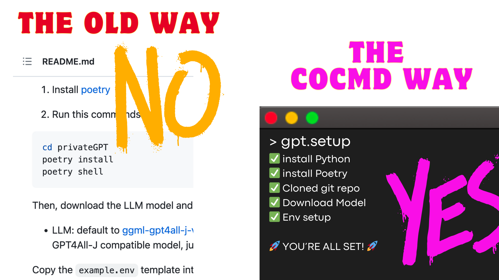

> Onboarding and Playbooks as Code

> Built with Rust 

> Dev Productivity Tool

# Features
- write command line workflows
- execute them from the terminal
- community-ready packages (hub)
- easy browsing and searching

# Getting Started

For installation and first step instructions, visit our [docs](https://cocmd.org/docs/intro)

## What is it good for?  

- New-hire Onboarding - [read more](https://cocmd.org/docs/showcase/onboarding)
- Daily Routines - [read more](https://cocmd.org/docs/showcase/routines)
- Codebase operations - [read more](https://cocmd.org/docs/showcase/cmdops)

## Contribute

Contribution guide can be found [here](https://cocmd.org/docs/contributing)

- [Add an Idea 💡💡💡 for a new playbook](https://github.com/cocmd/hub/issues/new)
- [Code with us - 🔥features / 🔥bugs](https://github.com/cocmd/cocmd/contribute)
- [Report a bug 🐞🧨🐞](https://github.com/cocmd/cocmd/issues/new?assignees=&labels=bug&projects=&template=bug_report.md&title=bug%3A+)

## Contributors of Cocmd CLI ❤️

<!-- readme: contributors -start -->
<table>
<tr>
    <td align="center">
        <a href="https://github.com/tevmji">
            
             
            <b>tevmji</b>
        </a>
    </td>
    <td align="center">
        <a href="https://github.com/mzsrtgzr2">
            
             
            <b>mzsrtgzr2</b>
        </a>
    </td>
    <td align="center">
        <a href="https://github.com/eyallampel1">
            
             
            <b>eyallampel1</b>
        </a>
    </td>
    <td align="center">
        <a href="https://github.com/yonahd">
            
             
            <b>yonahd</b>
        </a>
    </td>
    <td align="center">
        <a href="https://github.com/HillaShx">
            
             
            <b>HillaShx</b>
        </a>
    </td></tr>
</table>
<!-- readme: contributors -end -->

## License
Cocmd was created by [Moshe Roth](https://www.linkedin.com/in/mosherot/)
and is licensed under the [GPL-3.0 license](/LICENSE).
